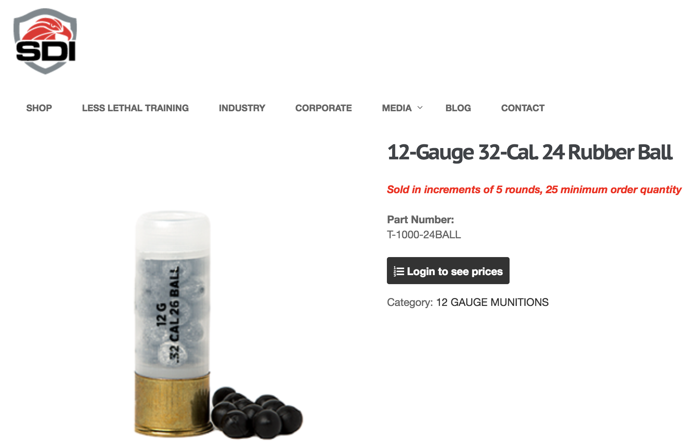
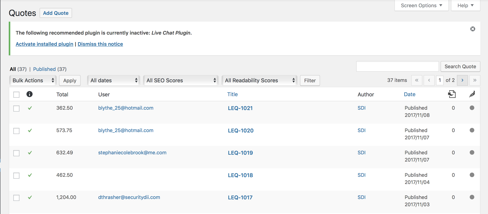
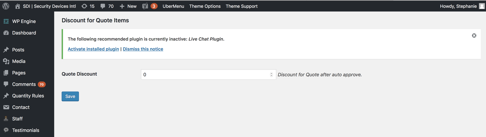
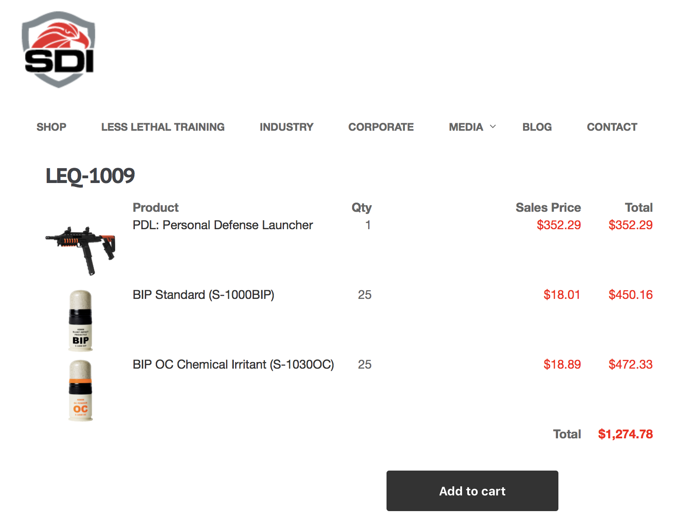
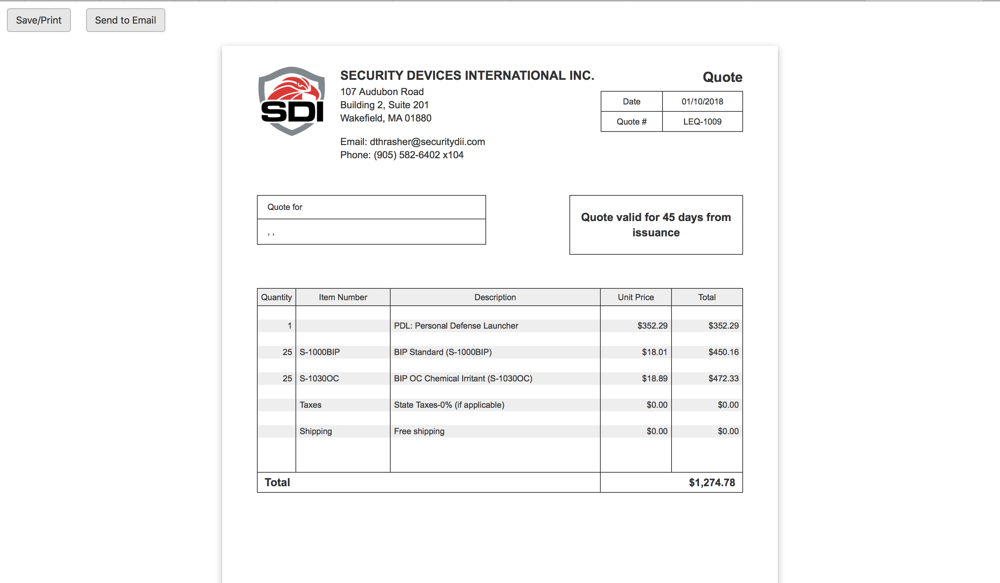

# Cart to Quote for WooCommerce plugin customization

The task included the following:
1. Disable the ability to purchase something until the user is logged in.

2. Make the quotes automatically approved with admin's involvement.

3. Add the field in WordPress dashboard where administrator can establish the discount for the quote(s).

4. Implement the ability for the users to easily turn the quotes into the orders from their accounts.

5. Create unique quote numbers which iterate order by order.
6. Design a branded PDF for quotes and add an option for user to print that PDF. It also pulls the tax rates according to user's address from Fedex plugin. User can either print or send it to his email.

7. Add a widget which will show the user the current state of his "quote cart", add it to nav menu.

